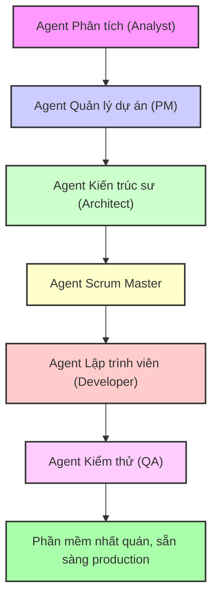

### **Một kịch bản quen thuộc: Sự hỗn loạn khi phát triển cùng AI** 😅

Khoảng sáu tháng trước, tôi cũng đã trải qua giai đoạn hỗn loạn khi cố gắng tích hợp AI vào quy trình phát triển phần mềm của mình.

Kịch bản có lẽ rất quen thuộc với nhiều người: Bạn có một ý tưởng tuyệt vời, liền mở ChatGPT hay Claude, đưa vào một prompt dài dòng mô tả mọi yêu cầu và hy vọng vào một kết quả mỹ mãn. Đôi khi, AI đưa ra những đoạn code rất hữu ích. Nhưng thường xuyên hơn, kết quả lại không như ý. AI bị mất ngữ cảnh, quên mất các quyết định về kiến trúc hệ thống, và cuối cùng bạn nhận được một mớ code mà về mặt kỹ thuật thì nó *chạy được*, nhưng lại có cảm giác như được viết bởi năm lập trình viên khác nhau chưa từng trao đổi với nhau.

Và rồi tôi khám phá ra **Phương pháp BMad** (Breakthrough Method of Agile AI-driven Development - Phương pháp đột phá trong phát triển phần mềm linh hoạt dựa trên AI), và mọi thứ đã thay đổi. Đây không chỉ là một công cụ trợ lý AI khác, hay một kỹ thuật "prompt engineering" thông thường.

**Đây là một phương pháp luận hoàn chỉnh, giúp biến việc phát triển với AI từ hỗn loạn thành một quy trình có hệ thống và có thể dự đoán được kết quả.** 🚀

Hãy cùng tôi đi qua hành trình này, để hiểu rõ tại sao cách tiếp cận truyền thống với AI lại kém hiệu quả và BMad đã giải quyết vấn đề đó như thế nào.

### **Vấn đề mà chính chúng ta không nhận ra** 🤔

Trong nhiều tháng, tôi đã nghĩ rằng mình đang làm việc "hiệu quả" khi nhảy thẳng vào việc viết code với AI. Cần một tính năng mới? Chỉ cần mở ChatGPT, đưa ra yêu cầu và bắt đầu chỉnh sửa. Nhưng thực tế những gì đã xảy ra là:

*   **Vòng xoáy mất ngữ cảnh** 🌪️: Mỗi cuộc hội thoại mới với AI đều bắt đầu từ đầu. Tôi tốn 20 phút đầu tiên của mỗi phiên làm việc chỉ để giải thích lại cấu trúc dự án, các quyết định về kiến trúc và tiêu chuẩn code. AI sẽ tạo ra code chạy được độc lập nhưng lại phá vỡ các mẫu (pattern) thiết kế hiện có.
*   **Khủng hoảng về sự nhất quán** 🎭: Các phiên làm việc khác nhau với AI tạo ra các cách tiếp cận khác nhau cho cùng một vấn đề. Hệ thống xác thực có ba mẫu thiết kế khác nhau nằm trong năm thành phần (component). Các câu truy vấn cơ sở dữ liệu không theo một quy ước nào. Các thành phần giao diện người dùng trông như được xây dựng bởi nhiều nhóm khác nhau.
*   **Nợ tài liệu kỹ thuật** 📚: Vì mọi thứ chỉ là các cuộc trò chuyện, tôi không có bất kỳ bản ghi chính thức nào về các quyết định kiến trúc. Ba tuần sau, khi cần thêm một tính năng mới, tôi không thể nhớ tại sao mình lại chọn cách làm đó – và AI dĩ nhiên cũng không thể nhớ giúp.
*   **Chất lượng không ổn định** 🎲: Đôi khi AI tạo ra code rất chất lượng, sẵn sàng để triển khai. Những lần khác, nó lại tạo ra thứ gì đó chỉ vừa đủ để không báo lỗi. Tôi không bao giờ biết mình sẽ nhận được gì và không có cách nào để đảm bảo chất lượng một cách hệ thống.

### **Khoảnh khắc đột phá** ⚡

Tôi lần đầu biết đến BMad khi đang vật lộn với một dự án full-stack phức tạp. Tôi liên tục chuyển đổi giữa các công cụ AI, cố gắng duy trì ngữ cảnh từ khâu lập kế hoạch, kiến trúc cho đến triển khai. Lịch sử trò chuyện của tôi trở nên khổng lồ, mâu thuẫn và gần như không thể tra cứu.

Lúc đó, tôi đọc được một bình luận trong một cuộc thảo luận trên GitHub:

> “Vấn đề không phải là AI không thể viết code - mà là chúng ta đang cố bắt một con AI làm tất cả mọi việc. Một đội ngũ phát triển con người còn có các chuyên gia riêng. Tại sao đội ngũ AI của chúng ta lại không?” 🤯

Điều này đã dẫn tôi đến kho tài liệu của BMad. Thứ tôi khám phá ra là một framework đã hệ thống hóa được điều mà tôi đã trăn trở từ lâu:

**Phát triển bằng AI cũng cần sự chuyên môn hóa và một quy trình có kỷ luật, tương tự như một đội ngũ phát triển con người.**

Nhưng bước đột phá thực sự đến khi tôi hiểu được cốt lõi của BMad:

**Ngữ cảnh (Context) là tất cả, và quản lý ngữ cảnh là vấn đề về quy trình (workflow), không phải là vấn đề về công cụ (tool).** 💡

### **Điều gì làm cho phương pháp BMad trở nên đột phá** 🔥

#### **Nguyên tắc chuyên môn hóa Agent** 👥

Cách phát triển với AI truyền thống thường diễn ra như sau:

*   **Bạn**: "Xây dựng cho tôi một ứng dụng quản lý công việc có xác thực người dùng, cập nhật thời gian thực và giao diện đáp ứng (responsive)."
*   **AI**: *Tạo ra 47 file với các mẫu thiết kế không nhất quán, thiếu xử lý các trường hợp biên và các quyết định kiến trúc không tối ưu* 😵💫

Trong khi đó, phát triển theo BMad sẽ như thế này:

*   **Agent Phân tích (Analyst)** 🔍: Nghiên cứu thị trường, xác định đối thủ cạnh tranh, tạo ra một bản tóm tắt dự án toàn diện.
*   **Agent Quản lý dự án (PM)** 📋: Chuyển bản tóm tắt thành một tài liệu yêu cầu sản phẩm (PRD) chi tiết với các yêu cầu chức năng, câu chuyện người dùng (user story) và tiêu chí thành công.
*   **Agent Kiến trúc sư (Architect)** 🏗️: Thiết kế kiến trúc hệ thống, lựa chọn công nghệ (tech stack), schema cơ sở dữ liệu, và đặc tả API.
*   **Agent Scrum Master** 📝: Tạo ra các story triển khai cực kỳ chi tiết từ bản thiết kế kiến trúc và PRD.
*   **Agent Lập trình viên (Developer)** 💻: Triển khai TỪNG story một với đầy đủ ngữ cảnh và tiêu chí chấp nhận rõ ràng.
*   **Agent Kiểm thử (QA)** ✅: Đánh giá code, tái cấu trúc để nâng cao chất lượng, và đảm bảo các bài kiểm thử đều thành công.

Mỗi agent là một chuyên gia. Mỗi agent có vai trò xác định. Mỗi agent hoạt động với một ngữ cảnh rõ ràng, tập trung vào chuyên môn của mình.

**Kết quả? Phần mềm nhất quán, sẵn sàng cho môi trường production, tuân thủ các nguyên tắc kiến trúc và tiêu chuẩn code.** 🎯

#### **Kỹ thuật Ngữ cảnh (Context Engineering), không phải Kỹ thuật Prompt (Prompt Engineering)** ⚙️

Đây là điểm sáng giá của BMad. Thay vì mỗi lần đều phải cố gắng tạo ra một prompt hoàn hảo, bạn sẽ xây dựng một **ngữ cảnh bền vững** xuyên suốt vòng đời phát triển của dự án:

*   **PRD liên kết trực tiếp đến các quyết định kiến trúc** 🔗
*   **Story chứa đựng ngữ cảnh triển khai hoàn chỉnh** 📖
*   **Tài liệu kiến trúc luôn được cập nhật song hành với codebase** 🏛️
*   **Nhật ký quyết định giải thích "tại sao" đằng sau mỗi lựa chọn** 🧠

Phép màu xảy ra khi Agent Lập trình viên của bạn mở một story và có sự hiểu biết hoàn toàn về cái gì cần xây dựng, làm thế nào để xây dựng nó, và tại sao—mà bạn không cần phải giải thích lại mọi thứ. ✨

#### **Phát triển dựa trên tài liệu (Document-Driven Development)** 📚

Mọi quyết định, yêu cầu, và lựa chọn kiến trúc đều trở thành một tài liệu sống. Nhưng chúng không chỉ là tài liệu—chúng là **ngữ cảnh có thể thực thi** để điều khiển quy trình phát triển của bạn.

Khi Agent PM tạo ra một PRD, nó không chỉ nằm yên trong Google Docs. Nó được "phân mảnh" thành các tài liệu nhỏ hơn, tập trung hơn mà Agent Lập trình viên có thể sử dụng trực tiếp trong quá trình triển khai. 🔄

#### **Quy trình hai giai đoạn** ⚡

Phương pháp này nhận ra rằng **lập kế hoạch và phát triển có những yêu cầu khác nhau**:

*   **Giai đoạn 1: Lập kế hoạch (Sử dụng Web UI - Tối ưu chi phí)** 💰
    *   Sử dụng các mô hình ngôn ngữ lớn (LLMs) có khả năng xử lý ngữ cảnh rộng để tư duy toàn diện.
    *   Tạo ra các bản đặc tả hoàn chỉnh một lần.
    *   Tận dụng nhiều agent để phân tích kỹ lưỡng.
    *   Tạo ra các tài liệu nền tảng định hướng cho toàn bộ dự án.
*   **Giai đoạn 2: Phát triển (Sử dụng IDE - Tập trung triển khai)** 🛠️
    *   Phân mảnh các tài liệu lớn thành các phần dễ quản lý.
    *   Thực hiện các chu kỳ phát triển tập trung với ngữ cảnh rõ ràng.
    *   Triển khai tuần tự, mỗi lần một story.
    *   Thao tác file và kiểm thử trong thời gian thực.

Sự tách biệt này **rất thông minh về mặt kinh tế**: các mô hình ngôn ngữ lớn, đắt tiền được dùng cho công việc tư duy phức tạp, sau đó là các agent hiệu quả, tập trung hơn cho việc triển khai. 🧠💻

### **Câu chuyện cá nhân: Hành trình đến với BMad** 📚

Để tôi kể cho bạn nghe khoảnh khắc chính xác mà tôi nhận ra cách phát triển với AI truyền thống không hiệu quả. Lúc đó tôi đã mất ba tuần để xây dựng một ứng dụng quản lý mục tiêu tên là “Steps” - một dự án tưởng chừng đơn giản nhưng đã trở thành một cơn ác mộng. 😱

#### **Cách làm cũ: Vòng lặp không hồi kết** 🔥

Đây là quy trình phát triển AI "hiệu quả" của tôi đã từng trông như thế nào:

*   **Thứ Hai**: Hào hứng viết một prompt cho ChatGPT mô tả ứng dụng trong mơ của mình. 🚀
*   **Thứ Ba**: Nhận ra code được tạo ra dùng một mẫu xác thực khác với ý muốn, phải bắt đầu lại. 😤
*   **Thứ Tư**: Một cuộc hội thoại mới, một phiên AI khác, và một thiết kế cơ sở dữ liệu hoàn toàn khác. 🤦♂️
*   **Thứ Năm**: Các thành phần frontend không tương thích với cấu trúc API của backend. 🤯
*   **Thứ Sáu**: Nhìn chằm chằm vào bốn hệ thống xác thực khác nhau trong năm file code. 😵💫

Sau ba tuần của vòng lặp này, tôi có:
*   Bốn mẫu xác thực khác nhau 🔐
*   Ba schema cơ sở dữ liệu không tương thích 📊
*   Các thành phần frontend không có sự nhất quán 🎨
*   Không có tài liệu nào về bất kỳ quyết định kiến trúc nào 📄
*   Một codebase mà tôi buộc phải viết lại thủ công 😰

#### **Sự khai sáng từ BMad** ✨

Sau đó tôi khám phá ra BMad. Thay vì bắt đầu lại với một "prompt tốt hơn", tôi quyết định theo một cách tiếp cận hoàn toàn khác: **lập kế hoạch có hệ thống trước khi viết bất kỳ dòng code nào.** 💡

Đây là những gì đã xảy ra khi tôi bắt đầu lại với BMad:

**Cuộc cách mạng trong lập kế hoạch (Tổng cộng 2 giờ)** 🔄

*   **Phiên làm việc với Agent Phân tích (20 phút)** 🔍: Thay vì nhảy vào các tính năng, Agent Phân tích đã đặt ra những câu hỏi quan trọng mà tôi chưa từng nghĩ tới. Kết quả: Một bản tóm tắt dự án toàn diện xác định **yêu cầu thực sự**.
*   **Phiên làm việc với Agent PM (30 phút)** 📋: Agent PM biến những ý tưởng mơ hồ của tôi thành các yêu cầu cụ thể: chân dung người dùng, yêu cầu chức năng, yêu cầu phi chức năng. Kết quả: Một **PRD 15 trang** chi tiết hơn bất cứ thứ gì tôi từng làm.
*   **Phiên làm việc với Agent Kiến trúc sư (45 phút)** 🏗️: Agent Kiến trúc sư thiết kế một hệ thống thực sự có thể xây dựng được: schema database, đặc tả REST API, hệ thống component frontend. Kết quả: Một **đặc tả kỹ thuật hoàn chỉnh** với sơ đồ, tài liệu API và hướng dẫn triển khai.
*   **Xác thực bởi PO (Product Owner) (15 phút)** ✅: PO đã phát hiện ba vấn đề tiềm ẩn mà tôi đã bỏ lỡ và xác minh mọi thứ đều ổn.

**Tổng thời gian lập kế hoạch: 2 giờ**. **Kết quả tôi nhận được: Các bản đặc tả chuyên nghiệp, loại bỏ hoàn toàn sự phỏng đoán trong quá trình kiến trúc.** 🏆

#### **Sự kỳ diệu của việc triển khai** ✨

Bây giờ mới đến phần khiến tôi kinh ngạc. Thay vì bắt đầu phát triển với một trang giấy trắng và hy vọng AI sẽ nhớ các cuộc trò chuyện trước, tôi đã có **ngữ cảnh hoàn chỉnh cho mọi quyết định phát triển**.

*   **Story giàu ngữ cảnh** 📖: Khi tôi cần triển khai, story đã chứa đầy đủ bối cảnh kiến trúc, nhiệm vụ chính xác và yêu cầu kiểm thử.
*   **Triển khai nhất quán** 🎯: Agent Lập trình viên không bao giờ hỏi "Nên dùng hệ thống xác thực nào?" hay "Nên cấu trúc cơ sở dữ liệu thế nào?". Nó đã biết câu trả lời, vì các quyết định đã được ghi lại và có thể truy cập.
*   **Không mất ngữ cảnh** 🔄: Không giống như cách phát triển truyền thống, mỗi story đều xây dựng dựa trên công việc trước đó một cách liền mạch.

**Kết quả thật đáng kinh ngạc** 🚀:
*   **Thời gian phát triển**: 1 tuần thay vì 3-4 tuần như thường lệ ⏱️
*   **Tính nhất quán kiến trúc**: 100% 🏆
*   **Nợ kỹ thuật (Technical debt)**: Gần như bằng không ✅
*   **Chất lượng code**: Cao hơn bất cứ thứ gì tôi tự viết thủ công 💯
*   **Sự tự tin**: Tôi có thể giải thích bất kỳ quyết định kiến trúc nào cho bất kỳ ai 😎

Quan trọng nhất, **khi tôi cần thêm một tính năng ba tháng sau, tất cả ngữ cảnh vẫn còn đó**. Không cần giải thích lại, không cần phải "khảo cổ" kiến trúc - chỉ cần triển khai dựa trên các quyết định đã được ghi lại.

### **Tại sao điều này thay đổi mọi thứ** 🔥

*   **Cuộc cách mạng về ngữ cảnh** 🔄: Phát triển với AI truyền thống thất bại vì **sự suy thoái của ngữ cảnh**. Với BMad, ngữ cảnh trở nên **bền vững và có cấu trúc**.
*   **Lợi thế của sự chuyên môn hóa** 👥: BMad áp dụng nguyên tắc chuyên môn hóa cho các agent AI. Mỗi agent có chuyên môn sâu, hoạt động với ngữ cảnh tập trung và tạo ra kết quả chất lượng, có thể đoán trước.
*   **Giải pháp cho vấn đề tài liệu** 📚: Với BMad, **mọi quyết định đều trở thành một tài liệu sống**, hướng dẫn cho sự phát triển trong tương lai, có thể tham khảo sau này và tạo ra kiến thức cho cả tổ chức.

### **Những nguyên tắc cốt lõi tạo nên sự khác biệt** ⚙️

1.  **Chuyên môn hóa Agent** 👥: Giống như một đội ngũ con người, các agent AI hoạt động tốt nhất khi có chuyên môn cụ thể.
2.  **Ngữ cảnh bền vững** 🔄: Các quyết định được ghi lại trong tài liệu và tồn tại suốt vòng đời phát triển của dự án.
3.  **Quy trình có hệ thống** 📝: Thay vì các prompt ngẫu hứng, có một chuỗi công việc đã được chứng minh để đảm bảo không bỏ sót điều gì.
4.  **Chất lượng thông qua quy trình** ✅: Cấu trúc và checklist đảm bảo chất lượng nhất quán thay vì hy vọng vào sự may rủi.
5.  **Phát triển dựa trên tài liệu** 📚: Các bản đặc tả không chỉ là tài liệu - chúng là ngữ cảnh có thể thực thi để điều khiển toàn bộ quy trình.

### **Ngoài phần mềm: Một Framework toàn cầu** 🌍

Điều đáng ngạc nhiên nhất là: BMad không chỉ dành cho phần mềm. Các nguyên tắc này có thể áp dụng cho **bất kỳ công việc phức tạp nào đòi hỏi chuyên môn hóa và tư duy hệ thống**. Framework này còn có các gói mở rộng cho:

*   **Phát triển Game** 🎮
*   **Viết sáng tạo** ✍️
*   **Chiến lược kinh doanh** 📈
*   **Quản lý hạ tầng** ☁️

### **Những gì tôi học được về phát triển với AI** 💡

Sau sáu tháng áp dụng BMad, tôi đã rút ra được vài sự thật cơ bản:

*   **Lập kế hoạch không phải là gánh nặng - nó là chất xúc tác tăng tốc** 🚀: 2 giờ lập kế hoạch có cấu trúc giúp tiết kiệm hơn 20 giờ phát triển trong sự mơ hồ.
*   **Chuyên môn hóa đánh bại sự tổng quát hóa** 🏆: Các agent chuyên biệt luôn cho kết quả tốt hơn đáng kể.
*   **Ngữ cảnh là yếu tố thay đổi cuộc chơi** 🔄: Quản lý ngữ cảnh là nền tảng của việc phát triển với AI chất lượng cao.
*   **Hiệu quả kinh tế** 💰: Chi phí lập kế hoạch ban đầu cao hơn, nhưng dẫn đến việc triển khai rẻ hơn và có thể dự đoán được. Tổng chi phí thấp hơn, chất lượng cao hơn và tiến độ thực sự có thể dự báo được.

### **Bước tiếp theo: Con đường phía trước của bạn** 🚀

Nếu bạn đã đọc đến đây, có lẽ bạn đang nghĩ: "Nghe có vẻ hay, nhưng bắt đầu từ đâu?". Đây là lời khuyên của tôi:

*   **Bắt đầu bằng việc hiểu, không phải bằng công cụ** 🧠: Hãy thấm nhuần các khái niệm cốt lõi: ngữ cảnh là tất cả, chuyên môn hóa là quan trọng, lập kế hoạch giúp tăng tốc, và quy trình tạo ra chất lượng.
*   **Thay đổi tư duy** 🔄: Bạn không chỉ đang dùng một công cụ AI - bạn đang **điều phối chuyên môn của AI**.
*   **Vượt qua sự cường điệu** ✨: BMad không phải là phép thuật - nó là sự áp dụng có hệ thống các nguyên tắc đã được chứng minh trong thực tế.

### **Bức tranh lớn hơn: Ý nghĩa đối với ngành phát triển phần mềm** 🌍

BMad cho thấy một cái nhìn trước về cách ngành phát triển phần mềm sẽ vận hành trong một tương lai lấy AI làm gốc.

*   **Từ Công cụ đến Đội ngũ** 👥: Chúng ta đang chuyển từ mô hình "AI giúp tôi viết code" sang "các thành viên trong đội ngũ AI với chuyên môn hóa".
*   **Vai trò mới của Lập trình viên** 👨💻: Vai trò của bạn sẽ phát triển từ "người viết code" thành **"người điều phối chuyên môn của AI"**.
*   **Ngữ cảnh là lợi thế cạnh tranh** 🏆: Các công ty làm chủ được kỹ thuật quản lý ngữ cảnh sẽ xây dựng sản phẩm nhanh hơn, nhất quán hơn và với chất lượng cao hơn.
*   **Ngôn ngữ tự nhiên như một giao diện lập trình** 💬: BMad chứng minh rằng ngôn ngữ tự nhiên có thể là một giao diện lập trình chính xác và mạnh mẽ khi được cấu trúc đúng cách.

Tóm lại, BMad không chỉ là về việc sử dụng AI tốt hơn - nó là về việc **thay đổi một cách cơ bản cách chúng ta tiếp cận phát triển phần mềm**. Tương lai của ngành phát triển là sự hợp tác, có hệ thống, và nó đã ở đây.
